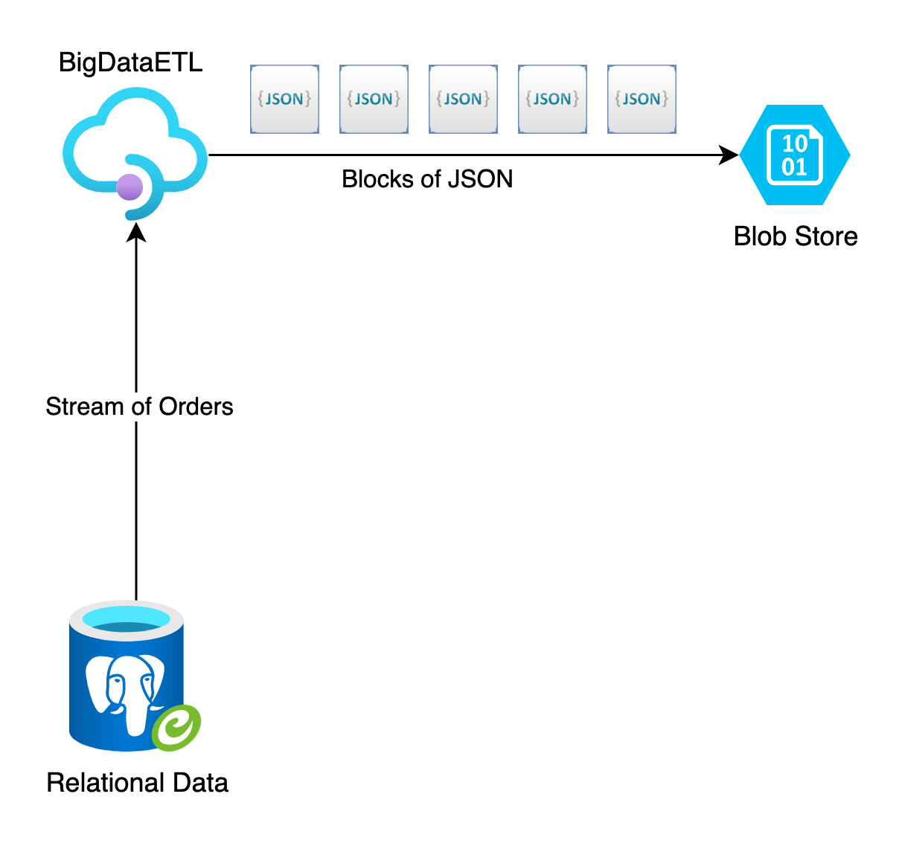

# BigDataETL
A proof of concept for streaming query results from Postgres and appending them to a blob in Azure Blob Storage.

<p align="center">
  
</p>

The goal was to stream, transform and store large amounts of data without consuming large amounts of memory. That's achieved by iterating over the ```IQueryable<Order>``` and adding every ```Order``` to the blob as a JSON string. This way no more than a single Order is in memory at a time.

Two ways of adding the JSON data to the blob are implemented:
* Each order is serialized as a JSON string and appended to the blob as a new block.
  * PRO: easy to implement.
  * CON: no more than 50000 Orders can be appended this way because that's the max amount of blocks in a blob. Additionally, a single Order might not fit into a single block.
* A block size is defined (between 0 and 4000MB - ses the [docs](https://learn.microsoft.com/en-us/rest/api/storageservices/understanding-block-blobs--append-blobs--and-page-blobs#about-block-blobs)). As many JSON-serialized orders are added to a single block as can fit inside, the block is uploaded and the next one is created until all orders are processed.
  * PRO: can store up to 190TB of Orders in a single blob (4000MB x 50000 blocks).
  * CON: slightly more complex logic fill up each block to its max defined size.

## Results
Deployed on Azure, with a Standard storage account, a B2 App Service Plan and a Postgres Flexible Server (Burstable Standard_B1ms) the results are:
* One Block Per Order: 1 minute 22 seconds for 5000 Orders -> 172.06MB Blob
* Multiple Orders per Block: 55 seconds for 5000 Orders -> 172.06MB Blob
* Straight download without Blob Store upload (return ```IAsyncEnumerable<Order>``` in controller method): 47 seconds

Note: There's a Requests.http file to easily play around with the service. It allows creating dummy data, querying the amount of Orders, straight data download to the client and the two ways of streaming it to a blob.
Adjust your file to point to your deployed system or leave it as is if you're testing against a locally running instance. There's also a little Swagger UI :D
